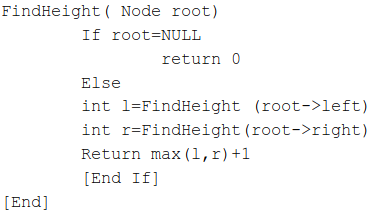
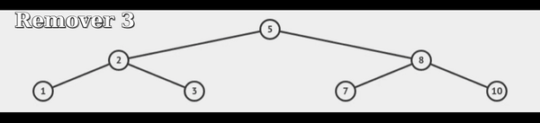
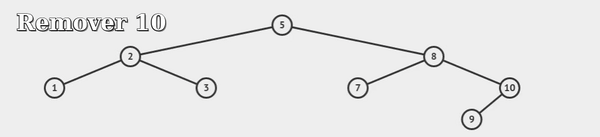
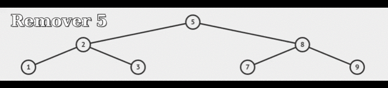
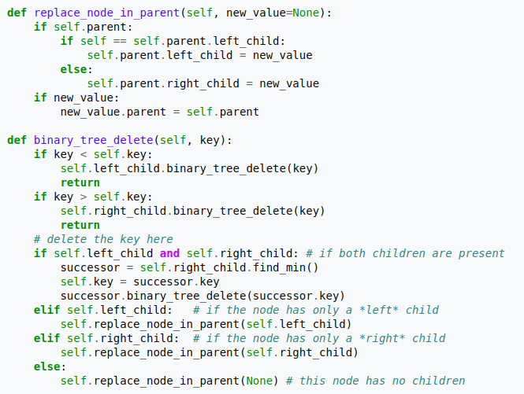
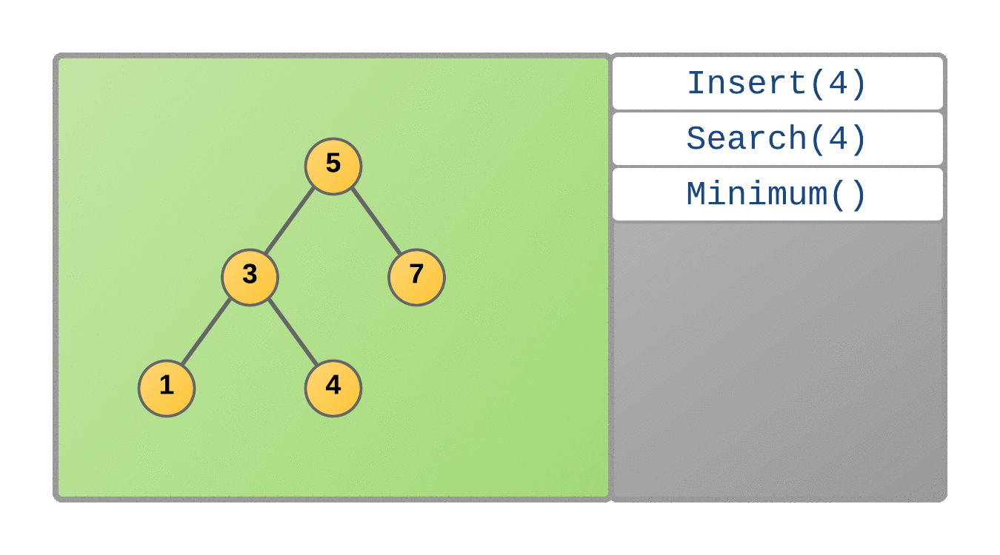
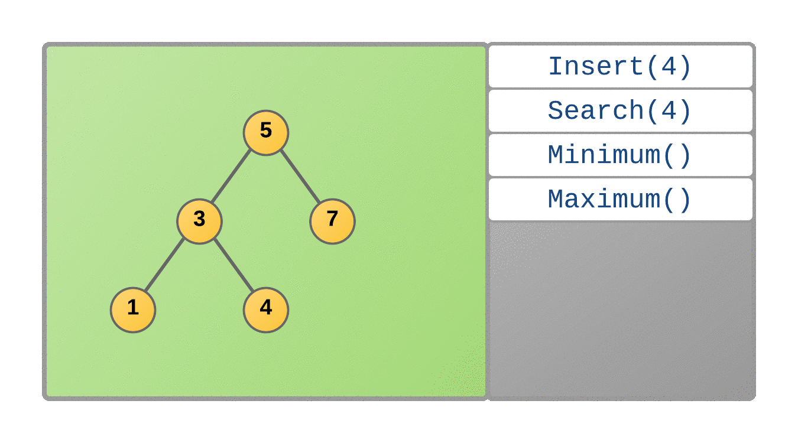
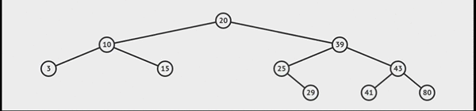
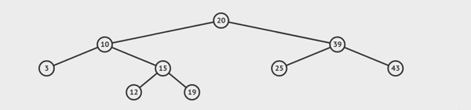
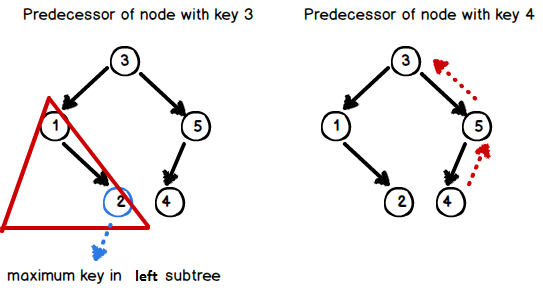

# 🌳 Árvore Binária de Busca

É um tipo de árvore binária, onde cada nó possui um valor associado e esse valor é quem define em que posição da árvore ele será inserido. Além disso, não possui elementos repetidos.

Para cada nó pai:
* Todos os valores da _subárvore esquerda_ são _menores_ que o nó pai!
* Todos os valores da _subárvore direita_ são _maiores_ que o nó pai!

## Métodos

### Inserção

Para inserir um valor na árvore deve-se seguir a receita:
- Compare o valor com a raiz.
- Se o valor é menor que a raiz então mande a subárvore da esquerda inserir o valor.
- Se o valor é maior que a raiz então mande a subárvore da direita inserir o valor.

_OBS.: Existe o caso onde a inserção é feita na raiz (árvore vazia)_

    
     
    Fonte: <a href="https://www.techiedelight.com/insertion-in-bst/">Math Warehouse</a>

**Pseudocódigo**

    
    

> **Complexidade:**  
> Caso Médio: O(log n)  
> Pior Caso: O(n) (árvore não balanceada)

### Altura

Informa a altura da árvore

     
    Fonte: <a href="https://www.includehelp.com/data-structure-tutorial/find-height-maximum-depth-of-a-binary-search-tree.aspx">Include Help</a>

**Pseudocódigo**

    

### Remoção

É necessário ter cuidado em 3 casos:

* **Caso 1: Nó que irá ser removido é um nó folha**

     
    Simulação feita no Visualgo

* **Caso 2: Nó que irá ser removido tem 1 filho**

     
    Simulação feita no Visualgo

* **Caso 3: Nó que irá ser removido tem 2 filhos**

     
    Simulação feita no Visualgo

**Pseudocódigo**

     
    Fonte: <a href="https://en.wikipedia.org/wiki/Binary_search_tree#Deletion">Wikipedia</a>

> **Complexidade:**  
> Caso Médio: O(log n)  
> Pior Caso: O(n) (árvore não balanceada)

### Máximo e Mínimo

O máximo da árvore é o elemento mais à direita e o mínimo é o mais à esquerda.

     
    Fonte: <a href="https://blog.pantuza.com/artigos/tipos-abstratos-de-dados-arvore-de-busca-binaria-binary-search-tree"> Pantuza </a>

     
    Fonte: <a href="https://blog.pantuza.com/artigos/tipos-abstratos-de-dados-arvore-de-busca-binaria-binary-search-tree"> Pantuza </a>

### Sucessor e Predecessor

**Sucessor:** imagine que os elementos da árvore estão em um array ordenado, o sucessor de _v_ é o próximo elemento no array, ou seja, se _v_ está na posição i, o sucessor de _v_ está na posição i + 1.

1. Possui filho à direita.

    

2. Caso contrário, o sucessor do nó será o ancestral mais baixo dele cujo filho da esquerda também seja um ancestral.

    

**Predecessor:** imagine novamente que os elementos da árvore estão em um array ordenado, o predecessor de _v_ é o elemento anterior a ele no array, ou seja, se _v_ está na posição i, o predecessor de _v_ está na posição i - 1.

1. Possui filho à esquerda.
2. Caso contrário, o seu predecessor será o seu ancestral mais baixo cujo seu filho direito seja também um ancestral do nó.

    
    

> OBS.: Se eu chamar o sucessor do máximo da árvore ou o predecessor do mínimo da árvore ambos os casos darão resultado `null`.

### Busca

Para buscar um valor na árvore deve-se seguir a receita:
- Compare o valor com a raiz.
- Se o valor é menor que a raiz então mande a subárvore da esquerda buscar o valor.
- Se o valor é maior que a raiz então mande a subárvore da direita buscar o valor.

     
    Fonte: <a href="https://www.techiedelight.com/insertion-in-bst/">Math Warehouse</a>

> **Complexidade:**  
> Caso Médio: O(log n)  
> Pior Caso: O(n) (árvore não balanceada)

### Pré, Pós e Ordem

* **Pré-ordem**

Coloca em um array todos os elementos da árvore seguindo o seguinte caminho: **RAIZ, ESQUERDA e DIREITA**.

* **Pós-ordem**

Coloca em um array todos os elementos da árvore seguindo o seguinte caminho: **ESQUERDA, DIREITA e RAIZ**.

* **Ordem**

Coloca num array todos os elementos da árvore seguindo o seguinte caminho: **ESQUERDA, RAIZ e DIREITA**.
