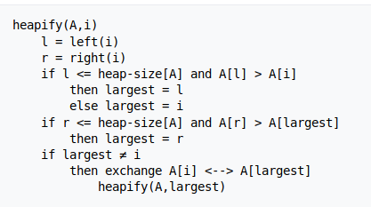
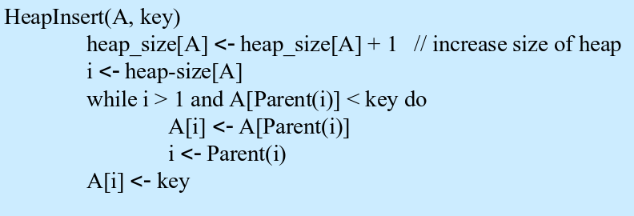
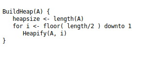
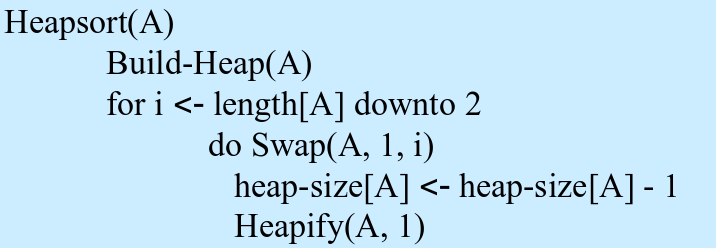

# Heap

É uma árvore binária onde satisfaz duas propriedades:
1. **Shape Property:** Estar completa até pelo menos seu penúltimo nível. Além disso, se o último nível não estiver completo, todos os nós do último nível deverão estar agrupados à esquerda.
2. **Tipo:** Uma heap pode ser do tipo _Max Heap_, onde todos os valores dos nós são menores do que o valor do nó pai (raiz possui maior valor), ou do tipo _Min Heap_, onde todos os valores dos nós são maiores do que o valor do nó pai (raiz possui menor valor).

     
    Fonte: <a href="https://www.techiedelight.com/introduction-priority-queues-using-binary-heaps/"> Techie Delight </a>

Cada posição do array passa a ser considerado pai de outras duas posições. Onde,
> O índice do pai de um elemento na posição _i_ pode ser obtido: `(i - 1) / 2`  
> O índice do filho à esquerda de um elemento na posição _i_ pode ser obtido: `2i + 1`  
> O índice do filho à direita de um elemento na posição _i_ pode ser obtido: `(2i + 1) + 1`

Exemplo: Observando a _Min Heap_ da imagem acima, temos o array `[2, 3, 6, 8, 10, 15, 18]`. Tomando 2 como exemplo:  
* 2 está na posição 0:
    * esquerda: `2 * 0 + 1 = 1`, logo 3 é o filho da esquerda de 2
    * direita: `(2 * 0 + 1) + 1 = 2`, logo 6 é o filho da direita de 2

## Métodos

### Heapify

Esse método é o que garante que as propriedades de uma heap se mantenham.

**Pseudocódigo**

     
    Fonte: Wikipédia

### Inserir

Para inserir um elemento na heap devemos colocá-lo na primeira posição vaga do array, ou seja, no final do array e em seguida levar o elemento para a posição correta de acordo com a prioridade da heap.

    

**Pseudocódigo**

    

### Build Heap

Permite construir uma heap a partir de um array passado como parâmetro.

**Pseudocódigo**

    

_OBS.: Vai até `length /2` pois após esse número a grande maioria dos elementos serão nó folha!_

### Extract Root Element

As remoções na heap ocorrem pela raiz. Logo, ao se remover a raiz se traz o último elemento para a posição e em seguida chama o Heapify para consertar a estrutura.

     
    Fonte: <a href="https://algorithms.tutorialhorizon.com/binary-min-max-heap/delete-or-extract-min-from-heap/">Algorithms @tutorialhorizon</a>

**Pseudocódigo**

    

### HeapSort

É uma forma de ordenar dados utilizando uma heap. Portanto, o método recebe um array e insere em uma heap, em seguida é só inserir os dados em um novo array, fazendo extrações pela raiz.

     
    Fonte: <a href="https://commons.wikimedia.org/wiki/File:Heap_sort_example.gif">Wikipédia</a>

**Pseudocódigo**

    

