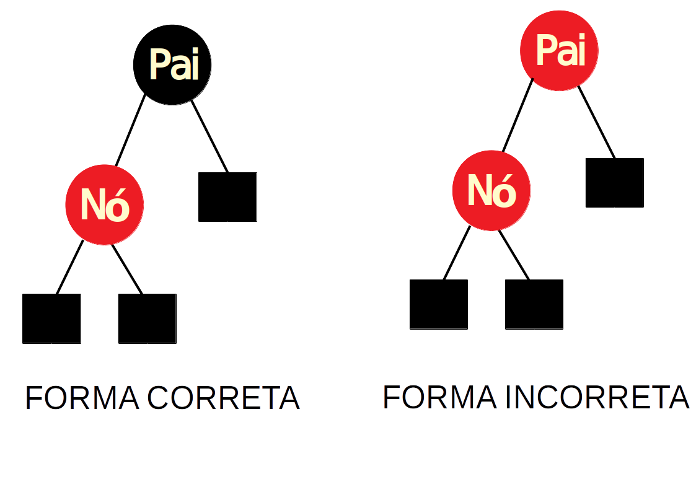
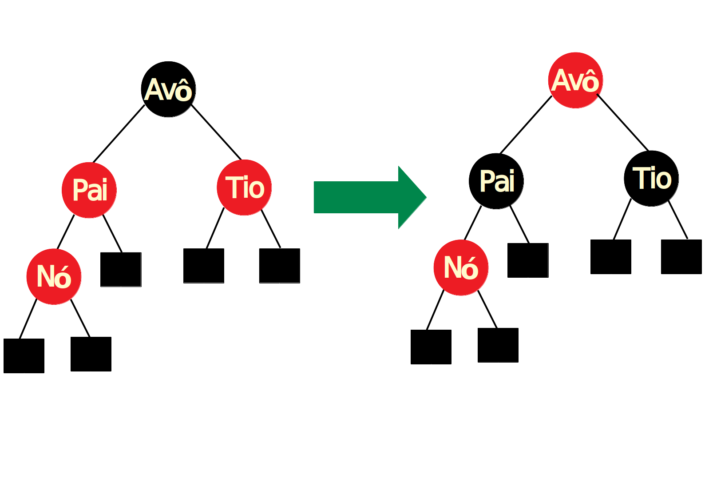
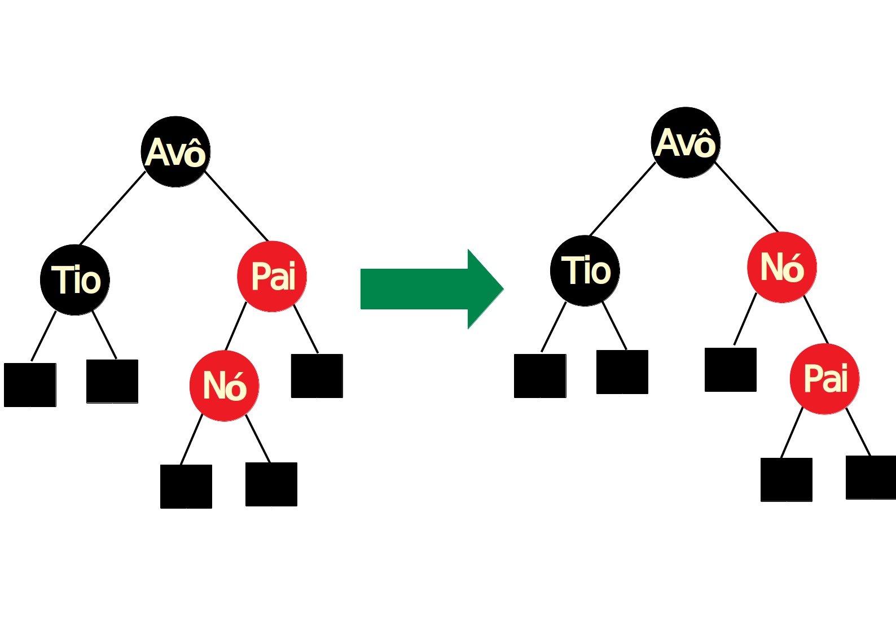
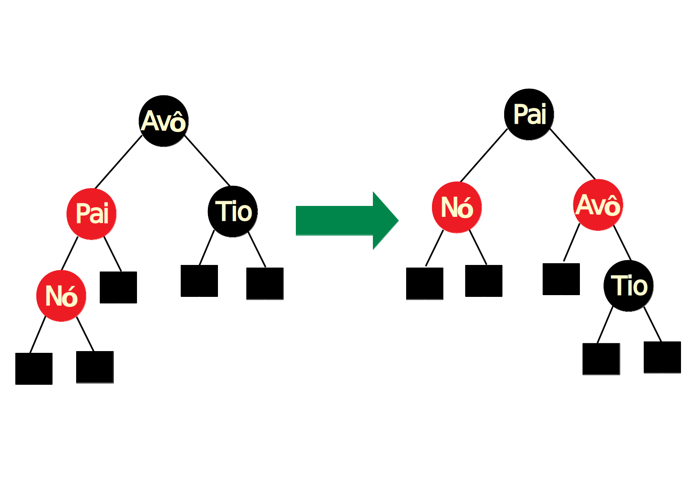

# Árvores Preto e Vermelho

É um tipo de árvore binária balanceada, cuja ideia de balanceamento é utilizar um esquema de cores.

Cada nó conterá uma informação extra, a cor, que pode ser **vermelha** ou **preta**.

Ela permite rebalanceamento local, ou seja, apenas na parte afetada pela inserção ou remoção e para isso se utiliza de rotações e mudanças de cores entre os nós para que as propriedades não sejam afetadas.

## Propriedades

1. Cada nó deverá ter uma cor vermelha ou preta;
2. Todo nó folha (NIL) é preto;
3. A raiz sempre é preta;
4. Se um nó é vermelho, então seus filhos são pretos (ou seja, não existem nós vermelhos consecutivos).
5. Todo caminho simples de um nó a uma folha descendente contém o mesmo número de nós pretos, que não sejam NIL. Isso é o chamado **black-height**.

     
    Fonte: <a href="https://pt.wikibooks.org/wiki/Algoritmos_e_Estruturas_de_Dados/%C3%81rvores_Rubro-Negras">WikiBooks</a>

## Métodos

### Black-Height

O black-height de um elemento _x_ é a quantidade de elementos pretos, sem contar _x_, até o final da árvore, sendo contado os nós NIL.

### Inserção

O elemento sempre é inserido como um nó vermelho e a inserção segue o mesmo procedimento de uma inserção em uma BST. Entretanto, se caso ocorrer alguma violação das propriedades citadas é necessário considerar 5 casos:

1. Se o nó inserido é a raiz, deve-se trocar a cor para preto, caso contrário vai para o caso 2.

    

        
    

2. Nesse caso ocorre a verificação da cor do pai, se for vermelha, então vai pra o caso 3, caso contrário não é necessário realizar nenhuma ação.

    

        
    

3. Para esse caso é necessário observar a cor do tio do nó. 
    * Caso a cor do tio seja vermelha é necessário  trocar as cores dos ancestrais do nó inserido:
        * O pai vira um nó preto
        * O tio vira um nó preto
        * O avó vira um nó vermelho.

        Após realizar essas trocas é necessário realizar o caso 1 em cima do avó.

    

        
    

    * Caso o tio seja preto é necessário executar o caso 4.

4. Nesse caso é necessário verificar se o nó é um filho à direita e o seu pai um filho à esquerda, então é necessário realizar uma rotação para a esquerda no pai. Caso contrário, ou seja, o nó é filho da direita e o pai filho da esquerda, é necessário realizar uma rotação para a direita no pai. Por fim, é chamado o caso 5 para o novo filho, independente do caso encontrado.

    

         
        Caso onde ocorre uma rotação para a esquerda no pai.
    

    

         
        Caso onde ocorre uma rotação para a direita no pai.
    

5. Inicialmente é necessário mudar a cor do pai para preto e do avó para vermelho do nó passado, que é o novo filho após a rotação realizada no caso anterior. Em seguida, se o nó passado é um filho à esquerda então se faz uma rotação para a direita sobre o avô, caso contrário uma rotação para a esquerda, também sobre o avô.

    

         
        Caso onde ocorre uma rotação para a esquerda no avô.
    

    

         
        Caso onde ocorre uma rotação para a direita no avô.
    
