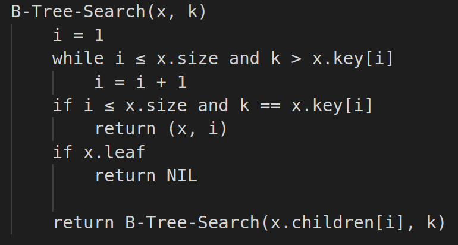

# Árvore B

É uma árvore balanceada que surgiu para que ocorra uma otimização no acesso a armazenamento secundário.

Diferentemente das árvores anteriores esta permite que um nó tenha mais que 2 filhos e, portanto, reduza o número de acessos a disco.

     
    Fonte: <a href="http://www.lcad.icmc.usp.br/~nonato/ED/B_arvore/btree.htm">Link da Referência</a>

## Propriedades

Considerando uma árvore B de ordem **m**:

1. Cada nó tem no máximo **m** filhos;
2. Cada nó, exceto a raiz, possui no máximo **`(m / 2) - 1`** filhos;
3. A raiz tem pelo menos 2 filhos se não for folha;
4. Todas as folhas estão no mesmo nível;
5. Um nó interno com _k_ filhos possui _k - 1_ chaves
6. As chaves de cada nó estão ordenados e servem como separadores dos filhos.

## Métodos

### Busca

Apesar de ser semelhante com a mesma operação realizada em uma BST é necessário lembrar que cada nó possui diversos elementos, logo é necessário fazer uma busca linear em cada nó.  
Em resumo, o processo consiste em realizar uma comparação do valor **x** buscado com as chaves presente no nó. Se não encontrar então a busca desce para a sub-árvore cujos separadores são x1 e x2, tal que: **x1 < x < x2**

**Pseudócodigo**

    

**Simulação de Execução**

     
    Fonte: <a href="http://condor.depaul.edu/ichu/csc383/notes/notes7/btree.html">Link da Referência</a>

### Inserção

A operação de inserção, inicialmente com a árvore vazia, deve garantir que o nó raiz será criado. Criado o nó raiz, a inserção das próximas chaves seguem o mesmo procedimento: busca-se a posição correta da chave em um nó folha e insere a chave garantindo a ordenação destas, desde que o nó não esteja cheio. Entretanto, se o nó onde deverá ocorrer a inserção já estiver cheio é necessário fazer uma divisão do nó:
* Ocorre a divisão do nó (split);
* Ocorre a promoção do elemento na árvore, ou seja, o elemento sobe na árvore;
* Se o pai estiver cheio é necessário subi-lo na árvore.

Considerando uma árvore B que possui no máximo 3 filhos cada nó, vejamos uma simulação da inserção de 1 a 7:

     
    Fonte: <a href="https://pt.wikipedia.org/wiki/%C3%81rvore_B">wikipédia</a>

#### Split

É um método que auxilia a realizar a divisão do nó no momento da inserção de um elemento.

1. Inicialmente escolhe o elemento médio dos elementos do nó, considerando o novo elemento já inserido;
2. Valores menores que a medianasão colocados em um novo nó folha (esquerdo) e valores maiores são colocados em um novo nó folha (direita);
3. O valor mediano é inserido como novo elemento do pai, o que pode ocasionar um split no nó pai;
4. Filhos da mediana ocupam o lugar do antigo nó (filho) do pai que foi dividido;

> É necessário notar que um split na raiz gera uma nova raiz!

     
    Fonte: <a href="https://pt.wikipedia.org/wiki/%C3%81rvore_B">Wikipédia</a>

**Simulação de Execução**

     
    Fonte: <a href="http://condor.depaul.edu/ichu/csc383/notes/notes7/btree.html">Link da Referência</a>

